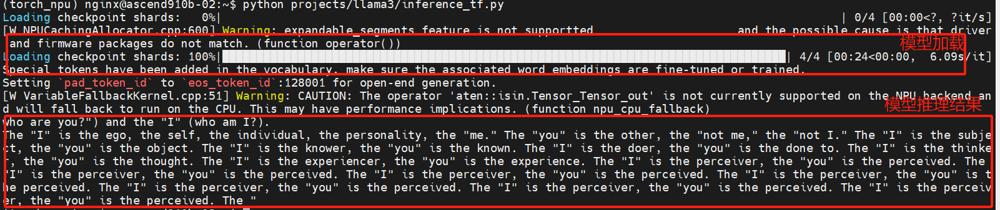
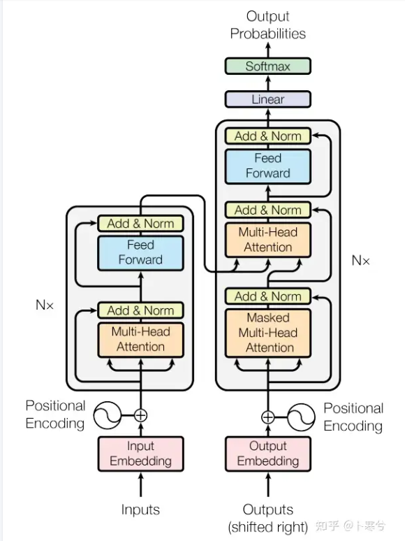

## 大语言模型

大语言模型（LLM）是一种利用机器学习技术来理解和生成人类语言的人工智能模型。对于希望从各个方面增强通信和数据处理并实现自动化的企业和机构而言，LLM 具有极高的价值。 

LLM 使用基于神经网络的模型，通常运用自然语言处理（NLP）技术来处理和计算其输出。NLP 是人工智能（AI）的一个分支领域，专注于使计算机能够理解、解释和生成文本，从而让 LLM 能够执行文本分析、情绪分析、语言翻译和语音识别等任务。

### 大语言模型原理

LLM 使用一种被称为无监督学习的方法来理解语言。这个过程要向机器学习模型提供大规模的数据集，其中包含数百亿个单词和短语，供模型学习和模仿。这种无监督的预训练学习阶段是开发 LLM（如 GPT-3（Generative Pre-trained Transformer ）和 BERT（Bidirectional Encoder Representations from Transformers）的基本步骤。 

换言之，即使没有明确的人类指令，计算机也能从数据中提取信息，建立联系并“学习”语言。模型通过学习语言中单词如何组合在一起的模式来理解语法和结构，之后，它就可以根据概率预测句子应采用的结构。最终就能形成一个能够捕捉单词和句子之间复杂关系的模型。 

### 模型具象

- 此处是llama3-8B模型的目录结构
~~~
Meta-Llama-3-8B                         ## 模型为LLama3-8B模型
├── config.json                         ## 存储模型的超参数 架构名称列表 学习率 attention_head 数量 层数等
├── configuration.json                  ## 模型使用的框架 Pytorch, tensorflow
├── generation_config.json              ## 文本生成模型的参数 开始标记ID 结束标记ID 填充标记ID等
├── LICENSE                             ## license
├── model-00001-of-00004.safetensors    ## 模型权重和参数的文件，除了.safetensors 还有.bin .pt .gguf等格式
├── model-00002-of-00004.safetensors    ##   
├── model-00003-of-00004.safetensors    ##
├── model-00004-of-00004.safetensors    ##
├── model.safetensors.index.json        ## 模型为safetensors格式时此文件帮助加载器快速定位和加载模型的权重数据
├── README.md                           ##
├── special_tokens_map.json             ## 特殊标记（special tokens）的映射关系 比如 bos_token eos_token等
├── tokenizer_config.json               ## 分词器的配置信息，例如词汇表大小、分词器类型、特殊标记等
├── tokenizer.json                      ## 分词器的词汇表 和 额外添加的特殊标记等
└── USE_POLICY.md                       ## 使用政策
~~~
### 模型使用

- 此处以模型的推理举例
~~~ python
import transformers
import torch

model_id = "/home/nginx/models/Meta-Llama-3-8B"
pipeline = transformers.pipeline(
        "text-generation", model=model_id, max_new_tokens=256,model_kwargs={"torch_dtype": torch.bfloat16}, device_map="npu:0"
)
outputs = pipeline("who are you?")
print(outputs[0]["generated_text"])
~~~

- 模型推理运行过程

## Transformer

Transformer 是一种专门为大多数 LLM 所实施的 NLP 任务设计的软件架构。Transformer 是流行的 LLM 基础模型（如 ChatGPT 和 BERT）的基本构建块。

Transformer 架构通过有效捕捉数据序列中元素（如句子中的单词）之间的上下文关系和依赖关系，增强机器学习模型的能力。它通过使用自注意力机制（也称为参数）来实现这一点，使模型能够权衡序列中不同元素的重要性，从而加强其理解和性能。各个参数定义了边界（即自注意机制中的权重和关注程度），而边界对于理解深度学习算法必须处理的大量数据至关重要。

Transformer 架构涉及数百万或数十亿个参数，这些参数使它能够捕捉复杂的语言模式和细微差别。

Transformers 提供了数以千计的预训练模型，支持 100 多种语言的文本分类、信息抽取、问答、摘要、翻译、文本生成。提供了便于快速下载和使用的API，方便用户把预训练模型用在给定文本、自定义数据集上微调然后通过 model hub 与社区共享。同时，每个定义的 Python 模块均完全独立，方便修改和快速研究实验。Transformers 支持三个最热门的深度学习库： Jax, PyTorch 以及 TensorFlow — 并与之无缝整合。可以直接使用一个框架训练模型然后用另一个加载和推理。

### 原理

- 多头自注意力机制

### 源码

~~~
.
├── benchmark
├── commands
├── data
├── generation
├── integrations
├── kernels
├── models
├── onnx
├── pipelines
├── quantizers
├── sagemaker
├── tools
└── utils

~~~

## 实践

## 细节